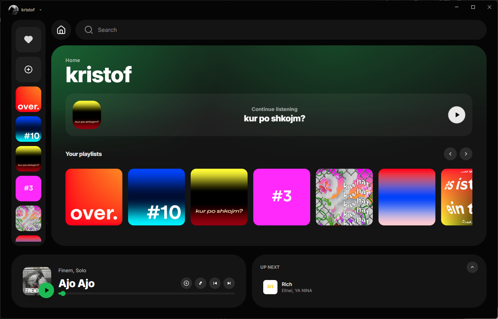

# 🎵 Muffle

A beautiful, fluid Spotify desktop client built with Svelte, Electron, and Tailwind CSS.



## ✨ Features

- **Fluid Animations** - Bouncy, liquid-like transitions inspired by Apple's design language
- **Modern UI** - Bubbly, rounded design that's easy on the eyes
- **Next Track Preview** - See what's coming up ~30 seconds before the current song ends
- **Smooth Song Transitions** - Satisfying "reverb" animation when tracks change
- **Native Desktop Experience** - Runs natively on Windows, macOS, and Linux

## 🚀 Getting Started

### Prerequisites

- [Node.js](https://nodejs.org/) (v18 or higher)
- [Bun](https://bun.sh/) (recommended) or npm
- A Spotify Premium account (required for playback SDK)

### Installation

1. Clone the repository:
```bash
git clone https://github.com/yourusername/muffle.git
cd muffle
```

2. Install dependencies:
```bash
bun install
```

3. Set up Spotify API credentials:
   - Go to [Spotify Developer Dashboard](https://developer.spotify.com/dashboard)
   - Create a new app
   - Add `http://localhost:5173/callback` to Redirect URIs
   - Copy your Client ID
   - Update `src/lib/stores/spotifyStore.js` with your Client ID:
   ```js
   const SPOTIFY_CLIENT_ID = 'your_client_id_here'
   ```

4. Start the development server:
```bash
bun run electron:dev
```

### Building for Production

```bash
bun run electron:build
```

This will create installable packages in the `release/` folder.

## 🎨 Design Philosophy

Muffle was designed to fix what we feel is wrong with the official Spotify client:

1. **Performance** - Built with Svelte for minimal overhead and maximum speed
2. **Aesthetics** - Rounded corners, subtle shadows, and fluid animations
3. **Delight** - Small touches like the bouncy buttons and the reverb animation make using the app enjoyable

## 🛠️ Tech Stack

- **[Svelte 5](https://svelte.dev/)** - Reactive UI framework
- **[Electron](https://www.electronjs.org/)** - Desktop app framework
- **[Tailwind CSS v4](https://tailwindcss.com/)** - Utility-first CSS
- **[Vite](https://vitejs.dev/)** - Build tool
- **[Spotify Web Playback SDK](https://developer.spotify.com/documentation/web-playback-sdk)** - Music playback

## 📁 Project Structure

```
muffle/
├── electron/
│   ├── main.js         # Electron main process
│   └── preload.js      # Preload script for IPC
├── src/
│   ├── lib/
│   │   ├── components/ # Svelte components
│   │   └── stores/     # Svelte stores (state management)
│   ├── App.svelte      # Root component
│   ├── app.css         # Global styles & animations
│   └── main.js         # App entry point
├── index.html
├── package.json
├── svelte.config.js
└── vite.config.js
```

## 🎵 Key Animations

### Fluid Card Hover
Cards lift and scale with a spring-bounce easing for a tactile feel.

### Song Transition Reverb
When a new song starts, the player "reverbs" with a ripple effect.

### Next Track Preview
About 30 seconds before a song ends, the next track's album art slides in from the left.

### Equalizer Animation
A mini equalizer pulses when music is playing.

## 📝 License

MIT

## 🙏 Acknowledgments

- Spotify for the amazing API and SDK
- The Svelte team for an incredible framework
- Electron team for making cross-platform apps possible
