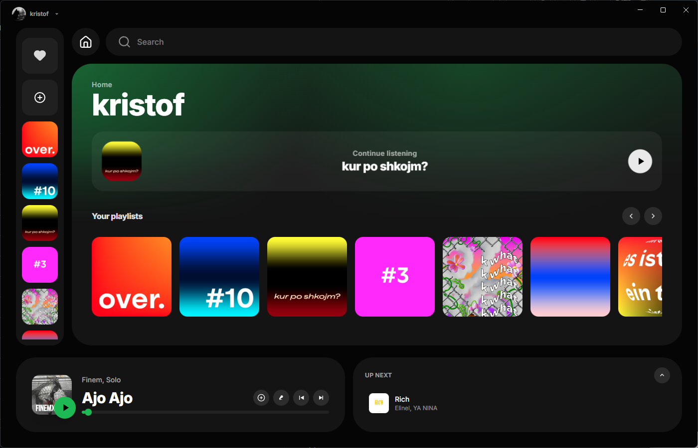

# Muffle

Muffle is a fast, expressive Spotify desktop client built with Svelte and Sabine. It talks to Spotify directly from its Rust host and plays audio through an embedded librespot engine, so there is no Electron process, browser token storage, Web Playback SDK, or sidecar executable.



## What it includes

- Home recommendations, mixes, recently played music, releases, artists, podcasts, and personal playlists
- Search across tracks, artists, albums, playlists, shows, and episodes
- Full library views for saved music, followed artists, playlists, and podcasts
- Artist, album, show, playlist, and Liked Songs pages
- Local high-quality playback with gapless playback, autoplay, normalisation, repeat, shuffle, queue control, audio caching, and Spotify Connect device transfer
- Native OAuth with PKCE, system media controls on Linux, single-instance handling, tray behaviour, and native playlist cover selection
- Keyboard media controls and shortcuts for search, volume, seeking, shuffle, repeat, lyrics, queue, home, and settings

## Development

Requirements:

- Bun 1.3 or newer
- Rust 1.95 or newer
- The platform prerequisites listed by [Sabine](https://github.com/Lantharos/Sabine)
- A Spotify Premium account for local playback

Install and check the project:

```bash
bun install
bun run check
cargo check --manifest-path desktop/Cargo.toml
```

Run the desktop development workflow:

```bash
bun run desktop
```

Build the web bundle or native installers:

```bash
bun run build
bun run bundle
```

## Spotify authorization

Muffle uses two native PKCE grants. The Web API grant provides the library, recommendations, search, and remote-control surfaces. The playback grant authorizes the embedded Connect player. Tokens and reusable playback credentials remain in the operating system's per-user application directories.

The shared Web API application works by default. To use your own Spotify application, add this redirect URI in the Spotify developer dashboard and enter its client ID in Muffle's settings:

```text
http://127.0.0.1:8989/login
```

Local playback uses:

```text
http://127.0.0.1:8898/login
```

Spotify requires an explicit loopback IP for desktop callback URLs. No client secret is used or stored.

## Project structure

```text
desktop/                    Rust host, OAuth, Spotify transport, playback, MPRIS
src/lib/components/         Muffle's Svelte interface
src/lib/stores/spotify/     UI state and Spotify feature models
src/lib/native.ts           Typed Sabine bridge
Sabine.toml                 Desktop and bundling configuration
```

Tagged releases are built by the Sabine release workflow for the supported desktop platforms.

Third-party attribution is recorded in [THIRD_PARTY_NOTICES.md](THIRD_PARTY_NOTICES.md).
